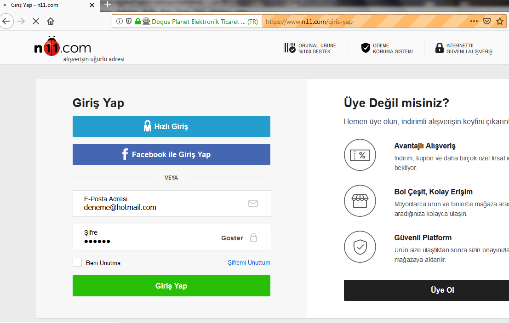
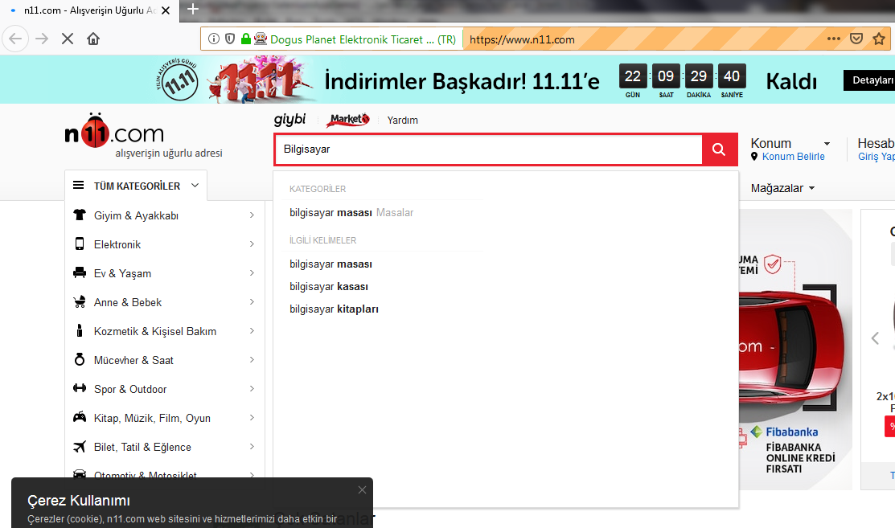
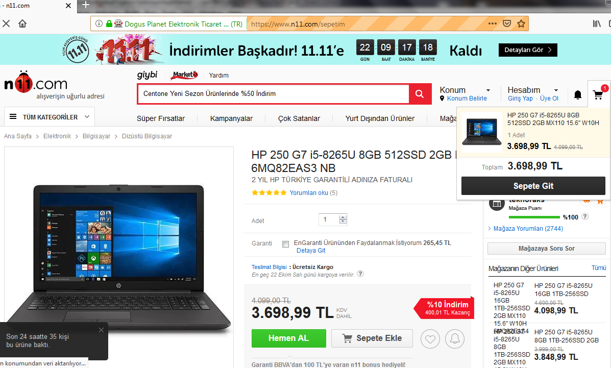
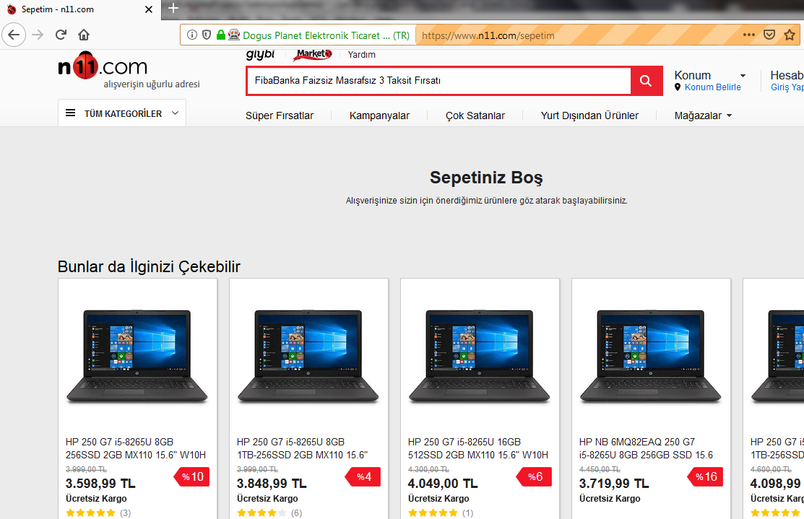

### Selenium Web Automation Project

<a href="https://www.n11.com/">n11.com</a> ,e-ticaret sitesi üzerinden senaryo testlerinin yapıldığı Mozilla Firefox uyumlu Selenium Web Otomasyon projesi

Site üzerinde gerçekleştirilen test senaryoları:
- Ana sayfanın açıldığı kontrol edilir ve siteye login olunur.
- Login işlemi kontrol edilir.
- Arama kutucuğuna bilgisayar kelimesi girilir.
- Arama sonuçları sayfasından 2. sayfa açılır.
- Sayfa 2'nin açıldığı kontrol edilir.
- Sonuca göre sergilenen ürünlerden rastgele bir ürün seçilir.
- Seçilen ürün sepete eklenir.
- Ürün sayfasındaki fiyat ile sepette yer alan ürün fiyatının doğruluğu
karşılaştırılır.
- Adet arttırılarak ürün adedinin 2 olduğu doğrulanır.
- Ürün sepetten silinerek sepetin boş olduğu kontrol edilir.

 

 
 

 
 

 
 

 

